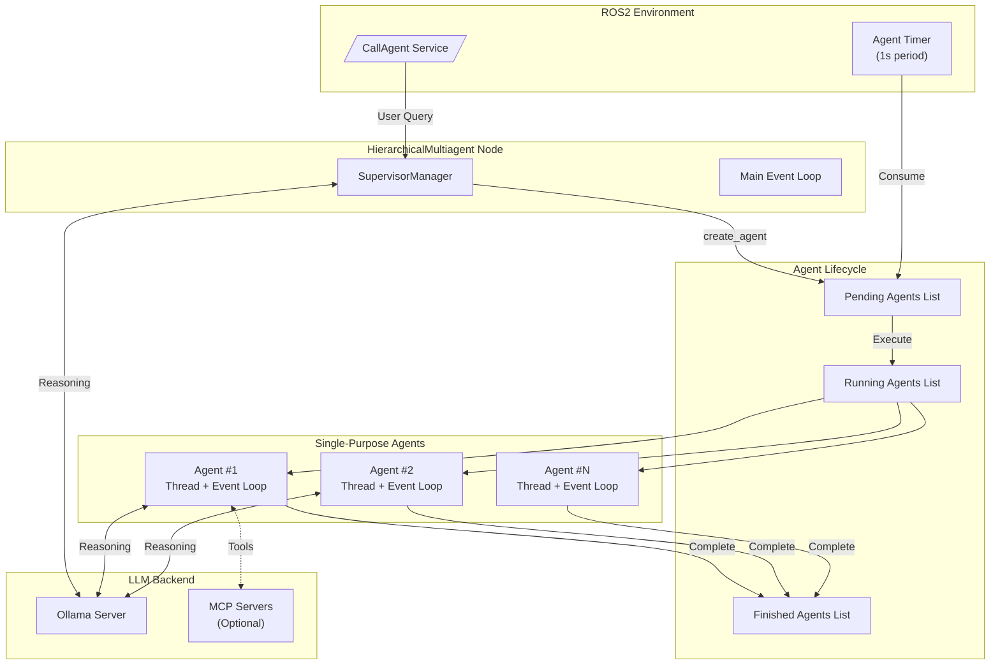
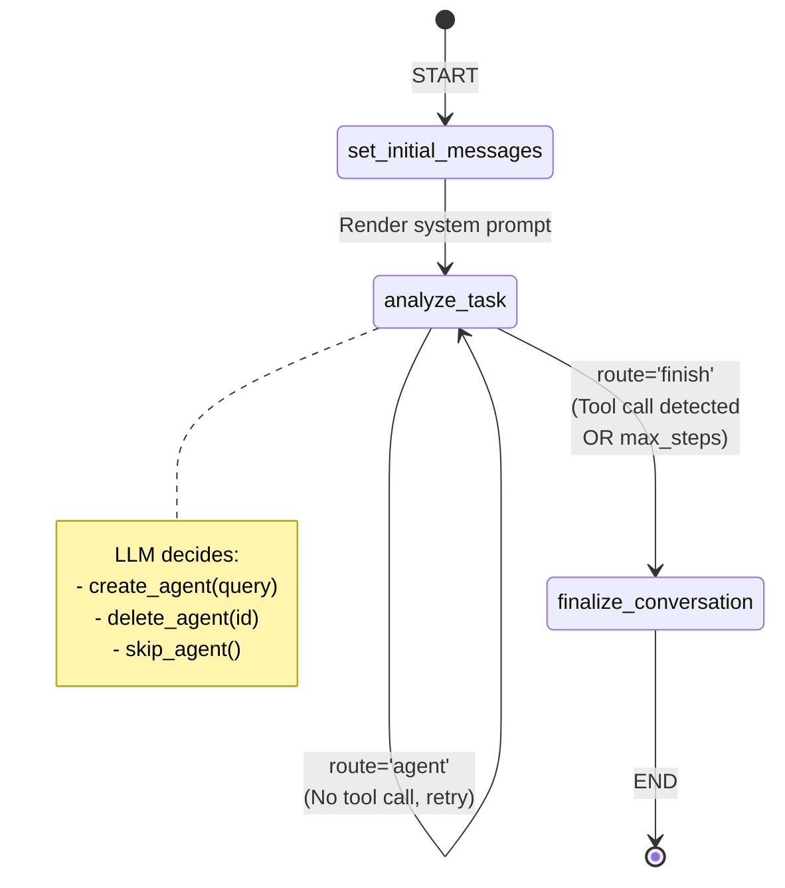
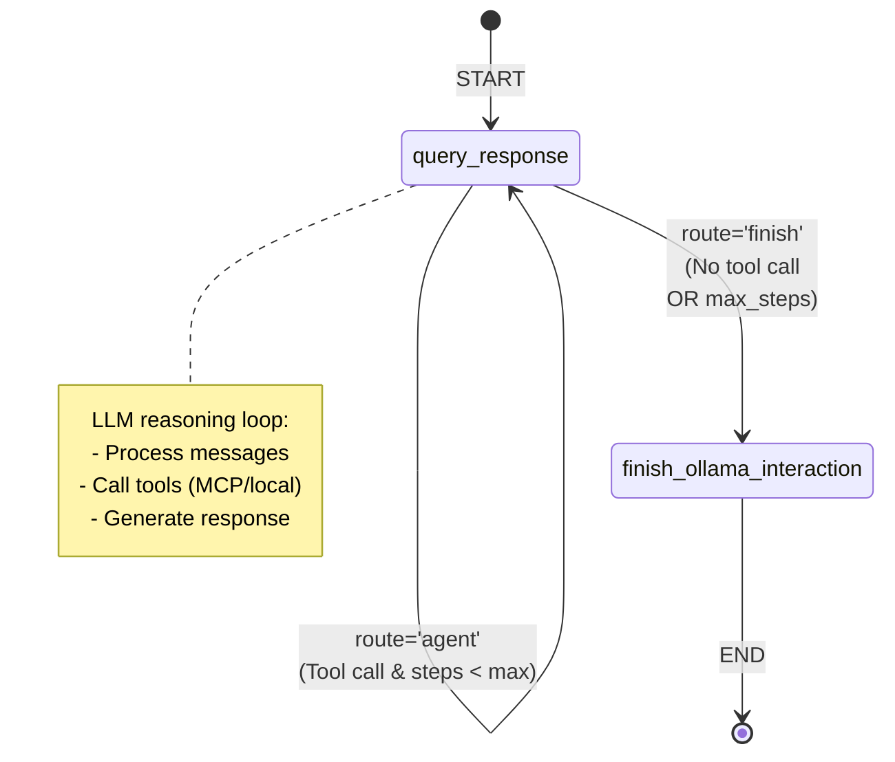
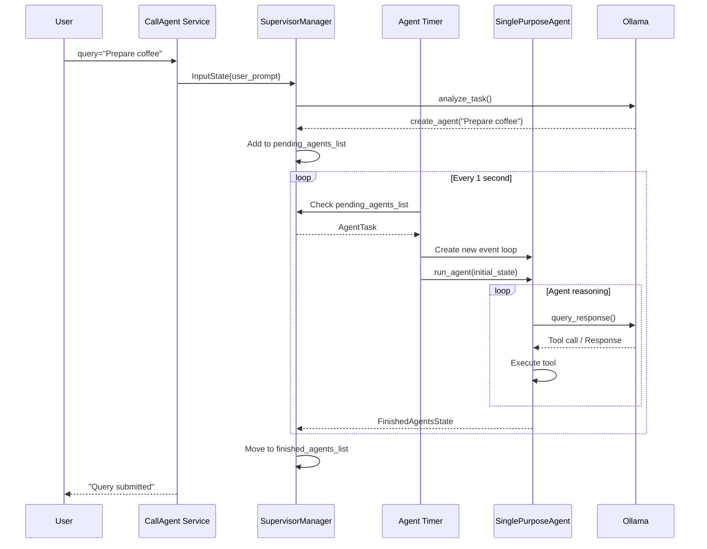
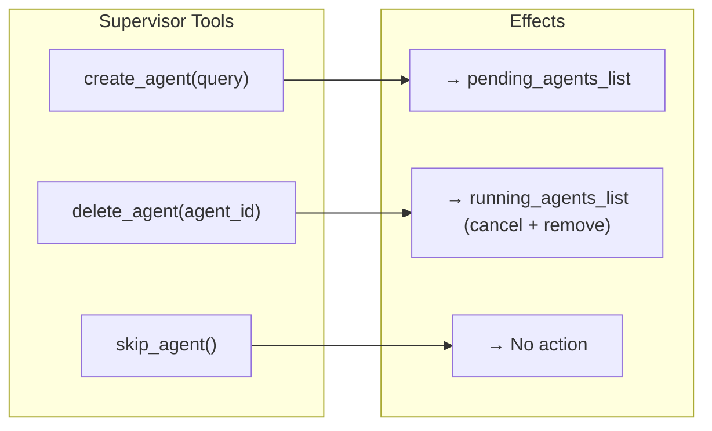
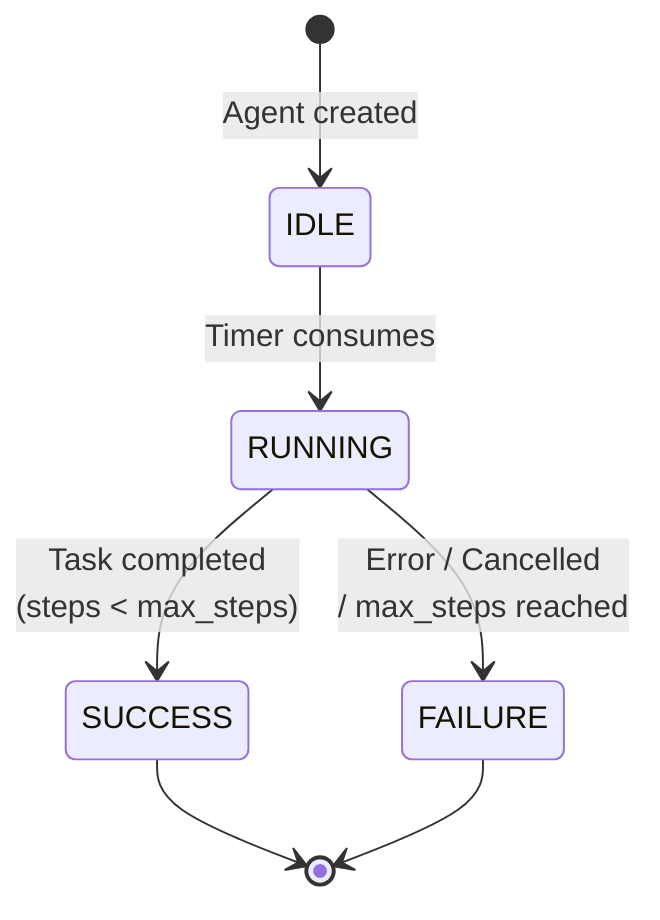

# Hierarchical Multiagent LangGraph


[](https://github.com/grupo-avispa/hierarchical_multiagent_langgraph/actions/workflows/build.yml)
[](https://codecov.io/gh/grupo-avispa/hierarchical_multiagent_langgraph)

This package implements a hierarchical multi-agent system where a **Supervisor** coordinates multiple **Single-Purpose Agents (SPAs)** to execute complex tasks. The system uses LLM models (via Ollama) for reasoning and decision-making, and LangGraph to orchestrate state graph-based workflows. Designed for native ROS2 integration, it enables robots to decompose user queries into subtasks and execute them in parallel through specialized agents.

## Key Features

- **Hierarchical architecture**: Supervisor → Specialized agents
- **LLM integration**: Ollama-based reasoning for intelligent decisions
- **Concurrent execution**: Multiple agents running in independent threads
- **Model Context Protocol (MCP)**: Support for external tools via MCP servers
- **Lifecycle management**: Dynamic agent creation, monitoring, and deletion
- **ROS2 integration**: Native service for receiving user queries

## Installation

### Building from Source

#### Dependencies

- [Robot Operating System (ROS) 2](https://docs.ros.org/en/jazzy/) (middleware for robotics),
- [langgraph_base_ros](https://github.com/grupo-avispa/langgraph_base_ros) (base for LangGraph-ROS2 integration),
- [llm_interactions_msgs](https://github.com/grupo-avispa/llm_interactions_msgs) (messages for LLM interactions),
- [langchain](https://github.com/langchain-ai/langchain) (framework for developing LLM applications)
- [langgraph](https://github.com/langchain-ai/langgraph) (framework for building language-based state graphs)

#### Building

To build from source, clone the latest version from the main repository into your colcon workspace and compile the package using

```bash
cd colcon_workspace/src
git clone https://github.com/grupo-avispa/hierarchical_multiagent_langgraph.git -b jazzy
cd ../
rosdep install -i --from-path src --rosdistro jazzy -y
colcon build --symlink-install
```

## Usage

With some scan source running, run the hierarchical_multiagent_langgraph node with:

```bash
ros2 launch hierarchical_multiagent_langgraph langgraph.launch.py
```

Then, the agent can be called with:

```bash
ros2 service call /hierarchical_multiagent/call_agent llm_interactions_msgs/srv/CallAgent "{query: 'Prepare a cup of coffee'}"
```

## System Architecture

### Overview



### Supervisor Workflow

The Supervisor uses a LangGraph state graph to analyze tasks and manage agents:



### Agent Workflow (SPA)

Each Single-Purpose Agent executes its own LangGraph graph to complete tasks:



### Agent Lifecycle



### Supervisor Tools



### Agent States



## Main Components

### HierarchicalMultiagent (main.py)

ROS2 node that manages the system lifecycle:

- Exposes `CallAgent` service to receive queries
- Runs periodic timer to consume pending agents
- Initializes and configures the `SupervisorManager`
- Manages multiple execution threads for agents

### SupervisorManager (supervisor.py)

Orchestrates multi-agent coordination:

- **LLM Tools**: `create_agent`, `delete_agent`, `skip_agent`
- **State management**: Thread-safe lists for pending/running/finished agents
- **LangGraph graph**: Analysis and decision workflow
- **Mutex protection**: `agent_lists_lock` for safe concurrent access

### SinglePurposeAgent (agent.py)

Specialized agent for individual tasks:

- **States**: `IDLE`, `RUNNING`, `SUCCESS`, `FAILURE`
- **MCP integration**: Access to external tools
- **Own graph**: Independent reasoning cycle
- **Isolation**: Separate event loop per agent


